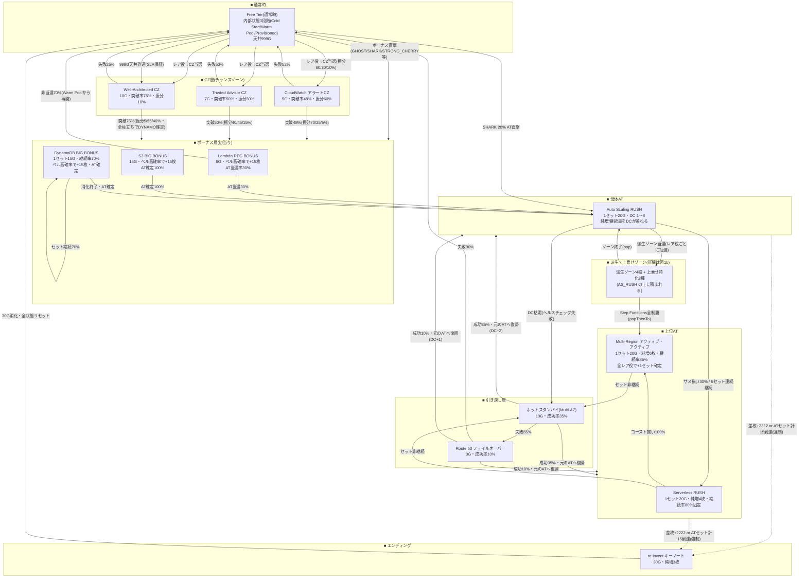
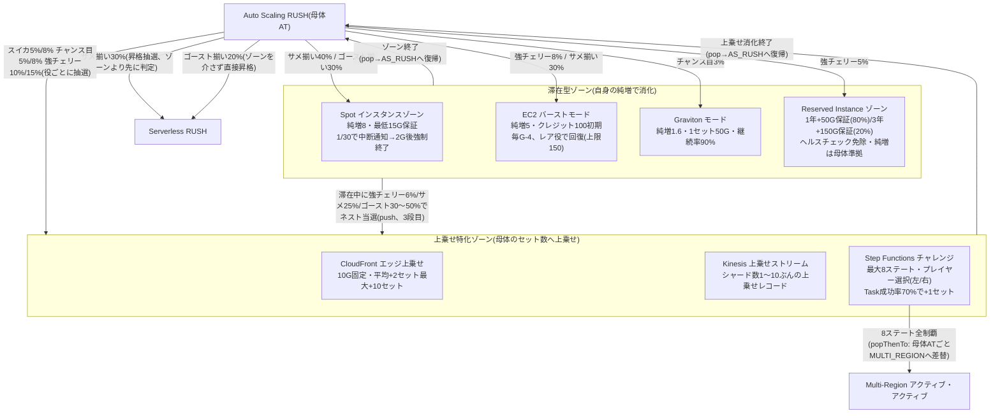
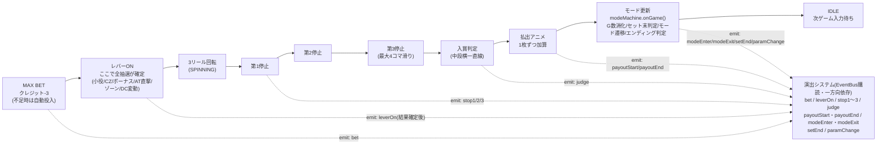
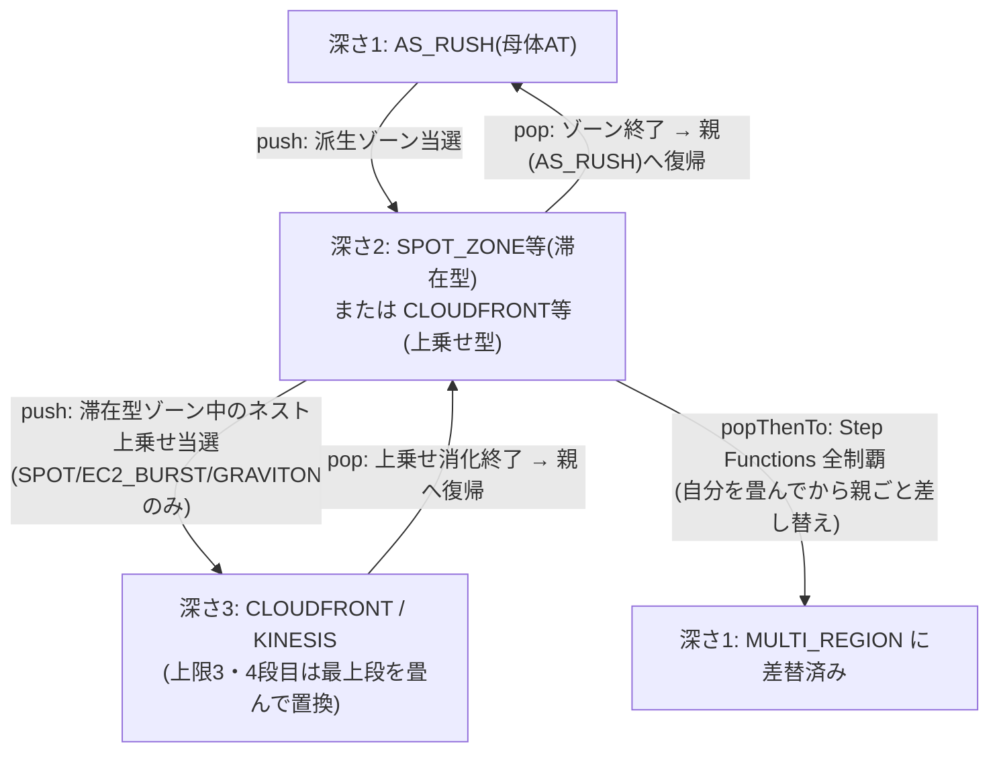

# AWSLOT ゲームフロー図

> **このドキュメントは実装コード(`src/data/transitions.js` / `src/data/modes.js` / `src/game/flow.js` / `src/game/modemachine.js` / `src/game/modes/*.js`)を正として作成している。**
> `docs/DESIGN.md` の数値と食い違う箇所があれば、こちらが実装済みの実際の挙動。
>
> ボーナス層の数値は 2026-08-13 の仕様変更(実装反映中)を反映した**新値**で記載している。
> 具体的には Lambda REG BONUS = 6G、S3 BIG BONUS = 15G、DynamoDB BIG BONUS = 1セット15G(継続率70%は変更なし)。
> 払出方式も「固定純増/G」から「ボーナス中はベルが高確率で揃い、1回成立につき+15枚」の方式に変更されている。

---

## 1. 全体モード遷移図

全20モードを層ごとに整理した幹図。派生ゾーン・上乗せ特化ゾーンの内部(どのレア役でどのゾーンに飛ぶか)は 1a では1つのノードにまとめており、詳細は「1b. 派生・上乗せゾーン拡大図」を参照。

### 1a. 幹図(通常時 → CZ → ボーナス → AT → 引き戻し → エンディング)

**読み方の補足**:
- `BONUSLAYER` への矢印は「3種のうちどれかに振り分け抽選される」ことを表す(振分率は矢印ラベルと2章「モード早見表」参照)。
- エンディング条件は `src/game/flow.js` の `_checkEnding()` がどのモードにいても毎ゲーム判定しており、条件を満たすと `modeMachine.forceMode('REINVENT_ED')` でスタックごと畳んで強制遷移する(図中の破線矢印)。
- ホットスタンバイ/Route 53 の「元のATへ復帰」は、転落前にいた AT(`AS_RUSH` / `SERVERLESS_RUSH` / `MULTI_REGION` のいずれか)を `resumeMode` パラメータで覚えておいて戻す実装(`src/game/modes/recovery.js` の `resumeTransition()`)。

### 1b. 派生・上乗せゾーン拡大図(AS_RUSH の上に積まれるモード群)

**読み方の補足**:
- `RESERVED` はネスト対象外(`src/game/modes/zones.js` の `reserved.onGame` に `nestedZone()` 呼び出しがない)。上乗せ特化ゾーンへ二重当選するのは `SPOT_ZONE` / `EC2_BURST` / `GRAVITON` の3つだけ。
- 派生ゾーンへの突入は `AS_RUSH` 中のみ実装されている(`SERVERLESS_RUSH` / `MULTI_REGION` 中はゾーン抽選そのものが存在しない)。
- `STEP_FUNCTIONS` の全制覇だけが唯一 `popThenTo` を使う特殊な遷移(自分を畳んでから、親の `AS_RUSH` ごと `MULTI_REGION` に差し替える)。

---

## 2. 1ゲームの流れ

`GameFlow`(第1層ステートマシン)の `IDLE → BET → READY → SPINNING → JUDGE → PAYOUT → TRANSITION → IDLE` を1本のレーンで表し、演出システム(`EventBus` 購読側)がどのタイミングでイベントを拾うかを1ノードにまとめている。

**読み方の補足**:
- 抽選(小役・CZ当選・ボーナス種別・AT直撃・スケールアウト等)はすべて「レバーON」の時点で確定する(`GameFlow.leverOn()` → `drawFlag()`)。以降のリール停止・演出はすべて「もう決まった結果」を表現するだけ。
- 演出側からゲーム状態を書き換えることは一切ない(`game/` は `render/` と `staging/` を import しない一方向依存)。
- 停止ボタンは `SPINNING` 中は通常の停止操作だが、`Step Functions チャレンジ` の分岐選択待ち(`modeMachine.awaitingChoice`)中は左/右ボタンがそのまま選択肢(A/D)として扱われる兼用ボタンになる。

---

## 3. モードスタックの入れ子図

派生ゾーン(滞在型・上乗せ型)は「親モードの上に積む」構造になっており、`ModeMachine` は単一モードではなく**スタック(深さ上限3)**を持つ。

**読み方の補足**:
- 通常の `pop` は「自分を畳んで、1つ下の親に制御を戻すだけ」(`ModeMachine._pop()`)。親のモードそのものは変わらない。
- `popThenTo` は `Step Functions チャレンジ`(深さ2)全制覇だけが使う特殊遷移で、「自分を畳んだ上で、さらに1つ下の親モードごと `MULTI_REGION` に差し替える」(`ModeMachine._popThenReplace()`)。結果としてスタックの深さは1に戻り、そこに `MULTI_REGION` が乗る。
- スタック上限は `MAX_STACK_DEPTH = 3`(`src/game/modemachine.js`)。上限に達した状態でさらに `push` しようとすると、最上段を畳んでから置換する安全弁が働く(`stackGuardHits` でデバッグ計測)。

---

## 4. モード早見表

`docs/DESIGN.md` の20モードすべてに対応。数値は `src/data/modes.js` の実装値(ボーナス層は2026-08-13付の新仕様値)。

| # | モード名 | 層 | 役割 | 主要スペック | 突入契機 |
|---|---|---|---|---|---|
| M01 | Free Tier(通常時) | 通常時 | メイン待機画面。内部状態でCZ確率が変動 | 内部状態3段階(Cold Start ×1.0 / Warm Pool ×2.0 / Provisioned ×4.0)、天井999G「SLA 99.9% 保証」 | ゲーム開始/各所からの転落先 |
| M02 | CloudWatch アラートCZ | CZ層 | 軽量CZ。折れ線グラフが閾値を超えれば突破 | 5G・突破率48%・CZ内振分60% | 通常時レア役でCZ当選→振分抽選 |
| M03 | Trusted Advisor CZ | CZ層 | 中位CZ。5項目チェックリスト、3項目以上グリーンで突破 | 7G・突破率50%・CZ内振分30% | 同上 |
| M04 | Well-Architected CZ | CZ層 | 最上位CZ。6本の柱、全立ちで最上位ボーナス確定 | 10G・突破率75%・CZ内振分10%(全柱立ち確率35%) | 同上 / 通常時999G天井到達で確定 |
| M05 | Lambda REG BONUS | ボーナス層 | 軽量ボーナス | **6G**・ベルが高確率で揃い1回成立につき+15枚・AT当選率30% | CZ突破時の振分(70/40/5%) / ボーナス直撃時の振分 |
| M06 | S3 BIG BONUS | ボーナス層 | 王道BIG。AT確定の安心感 | **15G**・ベルが高確率で揃い1回成立につき+15枚・AT確定100% | CZ突破時の振分(25/45/55%) / ボーナス直撃時の振分 |
| M07 | DynamoDB BIG BONUS | ボーナス層 | セット継続型の重量級。継続するほど伸びる | **1セット15G**・継続率70%・ベルが高確率で揃い1回成立につき+15枚・AT確定+DC初期値+2 | CZ突破時の振分(5/15/40%) / 直撃 / Well-Architected全柱立ちで確定 |
| M08 | Auto Scaling RUSH | 母体AT | 本機の出玉源。DC(1〜8)が純増と継続率を兼ねる | 1セット20G・DC別純増1.0〜3.8枚・DC別継続率45%〜80% | ボーナス終了(AT当選) / 通常時SHARK直撃20% / 引き戻し成功 |
| M09 | Spot インスタンスゾーン | 派生ゾーン | 爆発型。中断リスクと表裏一体 | 純増8枚・最低15G保証・1/30で中断通知→2G後強制終了(平均約30G) | AS_RUSH中 サメ揃い40% / ゴースト揃い30% |
| M10 | EC2 バーストモード | 派生ゾーン | クレジット消費型の爆発モード | 純増5枚・クレジット100初期・毎G-4、レア役で回復(上限150、平均約25G) | AS_RUSH中 強チェリー8% / サメ揃い30% |
| M11 | Graviton モード | 派生ゾーン | 安定型。低純増・高継続の長時間消化 | 純増1.6枚・1セット50G・継続率90% | AS_RUSH中 チャンス目3% |
| M12 | Reserved Instance ゾーン | 派生ゾーン | ゲーム数保証。ヘルスチェック免除 | 1年契約=+50G保証(80%) / 3年契約=+150G保証(20%)・純増は母体RUSH準拠 | AS_RUSH中 強チェリー5% |
| M13 | CloudFront エッジ上乗せ | 上乗せ特化 | 短時間・高純度の上乗せ | 10G固定・平均+2セット、最大+10セット | AS_RUSH中 スイカ5%/チャンス目8%/強チェリー15% / 滞在型ゾーン中のネスト当選(強チェリー6%/サメ25%/ゴースト30%) |
| M14 | Kinesis 上乗せストリーム | 上乗せ特化 | シャード数ぶんの上乗せが順に流れる | シャード数1〜10・シャードごとに上乗せレコード | AS_RUSH中 スイカ3%/チャンス目5%/強チェリー10%/サメ20% / 滞在型ゾーン中のネスト当選(サメ15%/ゴースト50%) |
| M15 | Step Functions チャレンジ | 上乗せ特化 | 唯一のプレイヤー選択モード | 最大8ステート・Task成功率70%で+1セット・全制覇でMULTI_REGION直行 | AS_RUSH中 サメ揃い10% / ゴースト揃い50% |
| M16 | Serverless RUSH | 上位AT | DC管理から解放される安定上位 | 1セット20G・純増4枚・継続率80%固定 | AS_RUSH中 サメ揃い30%(昇格抽選) / 5セット連続継続 / ゴースト揃い20%(ゾーンを介さず直接) |
| M17 | Multi-Region アクティブ・アクティブ | 上位AT | 最上位AT。全レア役で上乗せ確定 | 1セット20G・純増6枚・継続率85%・全レア役で+1セット確定 | Serverless RUSH中 ゴースト揃い100% / Step Functions全制覇(popThenTo) |
| M18 | ホットスタンバイ(Multi-AZ) | 引き戻し層 | RUSH終了時の第一防衛 | 10G・成功率35%・成功で元のATへ復帰(DC+2) | AS_RUSH/Serverless RUSH/Multi-Regionのセット非継続(DC枯渇・スロットリング・リージョン障害) |
| M19 | Route 53 フェイルオーバー | 引き戻し層 | 最後の砦 | 3G・成功率10%・成功で元のATへ復帰(DC+1) | ホットスタンバイ失敗時 |
| M20 | re:Invent キーノート | エンディング | 完走エンディング。全状態リセット | 30G・純増3枚・3Gごとに新サービス発表(最大10個) | 差枚+2222到達 または ATセット累計15到達(どのモードからでも強制遷移、条件達成後はカウンタをリセットして再度計測) |

**表の注記**:
- 「AT累計15セット」は AT層(`AS_RUSH` / `SERVERLESS_RUSH` / `MULTI_REGION`)のセット消化数の合計(`modeMachine.atSetCount`)。通常時(`FREE_TIER`)へ完全に落ちた時点で 0 にリセットされる(`ModeMachine._push()` 内、AT当選をまたいで累積しないようにするため)。
- ボーナス中の「ベルが高確率で揃い1回成立につき+15枚」は、旧仕様(固定純増N枚/G)からの変更点。`src/data/modes.js` のボーナス仕様(`BONUS_SPECS`)反映は別担当が並行実装中のため、値が未反映のままの場合は本表の新値を正として扱うこと。
