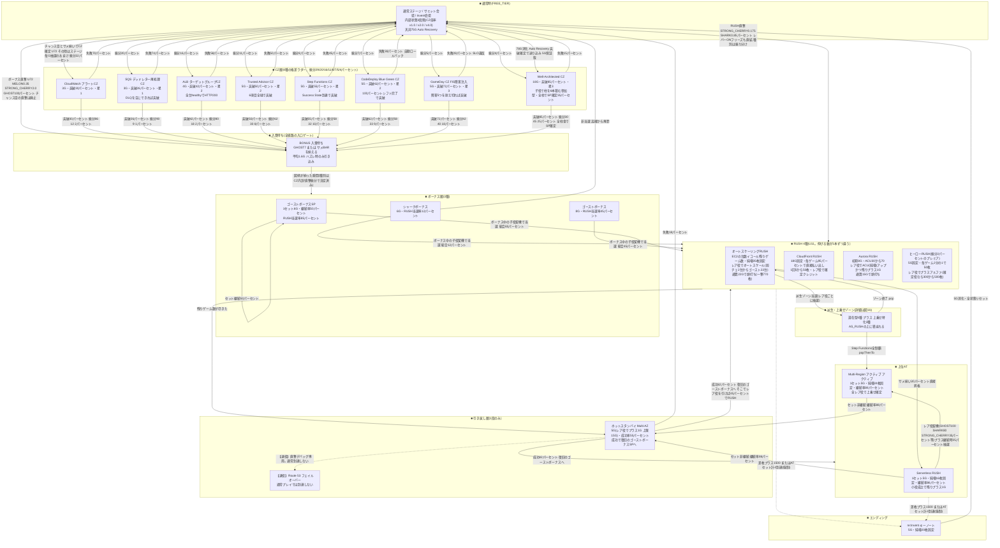
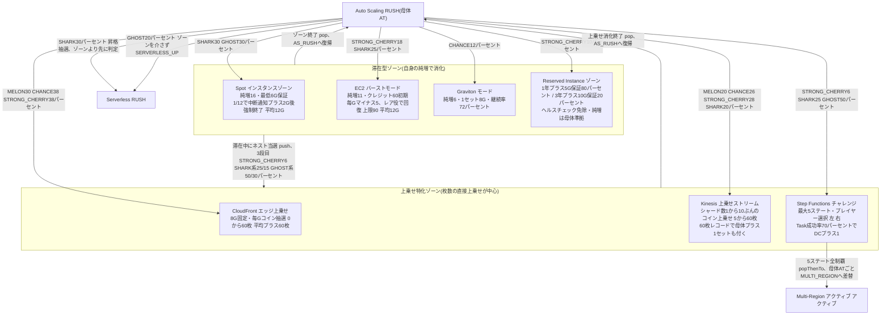
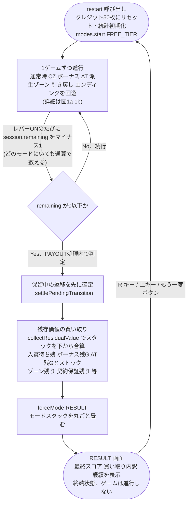
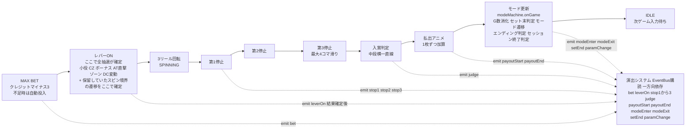
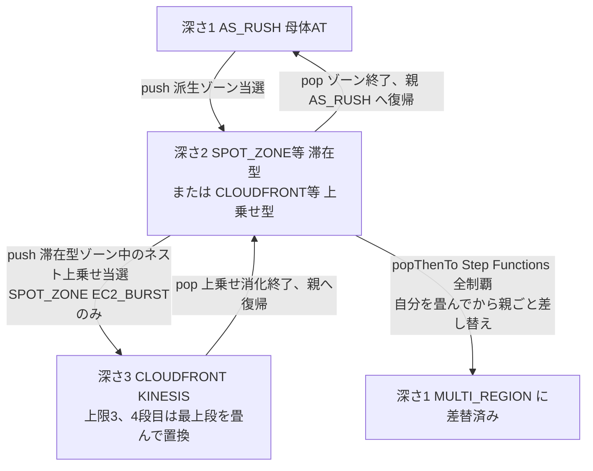

# JAWSLOT -ジョースロット- ゲームフロー図

> **表示名は「JAWSLOT -ジョースロット-」**(U45 / 2026-08-15)。
> コード上の識別子(`window.AWSLOT`)・ディレクトリ名・内部名は **AWSLOT のまま**。
> 改名するのはプレイヤーに見える文言だけ。

> **このドキュメントは実装コード(`src/data/session.js` / `src/data/modes.js` / `src/data/transitions.js` /
> `src/game/flow.js` / `src/game/modemachine.js` / `src/game/modes/*.js`)を正として作成している。**
> `docs/DESIGN.md` の数値・構成と食い違う箇所があれば、こちらが 2026-08-13 時点の実装済みの実際の挙動。
> 数値は `src/data/modes.js` 等の**現在値をそのまま転記**しており、今後の調整で変わりうる。
> 見た瞬間に古くなる資料なので、**数値の最終的な正はコード**であることを前提に読むこと。

2026-08-13 の1日で本機は次の3点が大きく変わった。旧版(初期実装ベース)の本ドキュメントはこれらを反映していなかったため全面更新している。

1. **100回転スコアアタック化**(`src/data/session.js`) — 「延々回す」台から「100回転で決着する」台になった。通常時・CZ・ボーナス・AT・派生ゾーンを問わず、レバーONを通算で数え、使い切ると残存価値を買い取ってリザルトへ。
2. **BONUS_READY(入賞待ち)の新設** — ボーナスは当選した瞬間には始まらず、まず入賞待ちへ入って GHOST7 / サメBAR を揃えてから消化が始まる(全ボーナス経路の入口ゲート)。
3. **引き戻しの1段化** — ホットスタンバイ → Route 53 の2段構成をホットスタンバイ1段に統合。Route 53 はハンドラのみ残る退役モード。

このほか、通常時のCZ導線が「レア役で直接CZ」から「ステージ(高確/激アツ)を経由してCZ」へ主役交代したこと、前兆システム・DeepRacer擬似連・「最初に止めるリール」3択演出(U53。旧AWSクイズルーレットの後継)が追加されたことも本ドキュメントに反映している。

---

## 1. 全体モード遷移図

到達可能なモードハンドラは `src/game/modemachine.js` の `MODE_HANDLERS` に18種類登録されている。うち `CZ` は `czId` で**8種**、`BONUS` は `bonusId` で3種、RUSH は4種に分かれるため、実質的な「モード」の数はDESIGN.mdの言う20種から増えて**27種(到達可能26 + 退役1)**になっている。退役モード(`ROUTE53_FAILOVER`)は点線で載せ、通常プレイでは通らないことを明記する。

### 1a. 幹図(通常時 → CZ → 入賞待ち → ボーナス → AT → 引き戻し → エンディング)

**読み方の補足**:
- `BONUS_READY` は `src/game/modemachine.js` の `ENTRY_GATE = { BONUS: 'BONUS_READY' }` で強制される「必ずここを経由する入口」。CZ突破・直撃・前兆やDeepRacer擬似連の当選など、ボーナスへ向かう経路がどれだけ増えても、`_push('BONUS', ...)` は自動的に `BONUS_READY` へ差し替わるので個別に直す必要がない。
- CZ・ボーナスとも「種別振り分け」はモードに入った時点(`onEnter`)で確定しており、`BONUS_READY` はどの絵柄を揃えさせるかを `state.targetSymbol` で持つだけ。図中では矢印の煩雑化を避けるため、CZ8種→`BONUS_READY` への矢印は各CZから1本ずつにとどめている(内訳は各CZのラベルに記載)。
- **前兆システム**(`src/data/zencho.js` / `src/game/modes/freetier.js`): 当選(CZ/AT/BONUS)は即座に画面が変わらず、本前兆(2〜5G、当選を保持)を挟んでから告知する。非当選中も 1/40 の確率でガセ前兆(2〜4G)が発生し、前兆中に当選するとガセ→本前兆へ格上げされる(当選を持ったまま格が下がることはない)。**DeepRacer擬似連**は前兆パターンの1つで、step3到達(到達率約29%)で50%の確率でCZへ移行、step4到達(約9%)でボーナス確定、さらに擬似連中にレア役を引くと即ボーナス確定へ格上げされる。
- **「告知→次スピンで移行」の原則**(`onNextSpin`): 当選告知・CZ結果・天井到達・DC全滅・引き戻し成否は、すべて**告知が起きたモードの画面のまま**そのゲームを終え、**次にレバーを引いた瞬間**に新モードへ入る(3章で詳述)。図の矢印はすべてこの原則に従う。
- エンディング条件(`ending_cond`)はどのモードにいても毎ゲーム `GameFlow._checkEnding()` が判定しており、成立すると `modeMachine.forceMode('REINVENT_ED')` でスタックごと畳んで強制遷移する(図中の破線矢印)。図では代表して `ATLAYER` / `UPPERATLAYER` からの矢印にしているが、実際は通常時・CZ・ボーナス中でも判定は走る(到達しうるのは主に差枚が伸びやすいAT系)。
- ホットスタンバイの「元のATへ復帰」は、転落前にいたAT(`AS_RUSH` / `SERVERLESS_RUSH` / `MULTI_REGION`)を `resumeMode` パラメータで覚えておいて戻す実装(`src/game/modes/recovery.js` の `resumeTransition()`)。復帰・転落のどちらも `onNextSpin` で、結果演出(切替完了 / RTO超過)を見せ切ってから次のレバーONで遷移する。

### 1b. 派生・上乗せゾーン拡大図(AS_RUSH の上に積まれるモード群)

**読み方の補足**:
- `RESERVED` はネスト対象外(`src/game/modes/zones.js` の `reserved.onGame` に `nestedZone()` 呼び出しがない)。上乗せ特化ゾーンへ二重当選するのは `SPOT_ZONE` / `EC2_BURST` の2つだけ(`GRAVITON` はテーブル未定義のため実質ネストしない)。
- 派生ゾーンへの突入は `AS_RUSH` 中のみ実装されている(`SERVERLESS_RUSH` / `MULTI_REGION` 中はゾーン抽選そのものが存在しない。両モードとも「レア役=昇格 or 上乗せ確定」で完結する)。
- `STEP_FUNCTIONS` の全制覇だけが唯一 `popThenTo` を使う特殊な遷移(自分を畳んでから、親の `AS_RUSH` ごと `MULTI_REGION` に差し替える)。派生ゾーンで積んだ上乗せストック(`stock`)は差し替え後の `MULTI_REGION` へそのまま引き継がれる。
- 上乗せ特化ゾーン(`CLOUDFRONT` / `KINESIS` / `STEP_FUNCTIONS`)は旧仕様の「母体セット数への上乗せ」から、100回転スコアアタック化(2026-08-13)で**枚数の直接上乗せ + 純増ブースト(DC)中心**へ作り替えられている。50〜100回転しか持ち時間がないため、G数上乗せは消化しきれず数字遊びになるという判断による。

---

## 2. 100回転スコアアタックのライフサイクル

本機は「延々回す」台ではなく、**通算100回転で1プレイが終わるスコアアタック**(`src/data/session.js`)。通常時・CZ・ボーナス・AT・派生ゾーンのどこにいても、レバーONのたびに `GameFlow.session.remaining` が減っていく(モードごとの知識を持たないカウンタ)。

**読み方の補足**:
- **買い取る/買い取らない基準**(`src/data/session.js` 冒頭コメント): 残ゲーム数×現在純増や確定済みストックのように「**既に所有している権利**」は買い取る。一方、セット継続抽選の期待値や CZ の突破期待値のように「**まだ引いていない権利**」は買い取らない(買うと「終了間際にCZへ入るのが一番得」という歪みが出るため)。
- `collectResidualValue()`(`src/game/modemachine.js`)はモードスタックを下から順に舐め、各ハンドラの `residualValue(state, ctx)` を合算するだけで、モード固有の知識を持たない(`game/` → `data/` の依存方向を保つ設計)。派生ゾーン・上乗せ特化ゾーンは母体ATの純増(`ctx.host`)を必要とするため、買い取り計算にもホストを渡す。
- エンディング(`REINVENT_ED`)はセッション内で複数回起こりうる**別イベント**。差枚+1500やATセット計4に達するたびに発火し、5G消化して `FREE_TIER` へ戻る。エンディング中に100回転を使い切った場合も、残りG(`residualValue`)がそのまま買い取り対象になる。
- リザルト表示中(`session.ended = true`)は `GameFlow.canBet` が `false` を返すため新しいBETは受け付けない。`GameFlow.play()` が `session.ended` を見て自動的に `restart()` を呼ぶため、R/↑キー/筐体のワンボタン操作のどれでも次のセッションへ進める。
- `restart()` のたびに `session.index` がインクリメントされ、クレジットは常に `SESSION.startCredit = 50` から再スタートする(スコアは差枚 `credit.diff` で見るため初期クレジットの値そのものに意味はない)。

---

## 3. 1ゲームの流れ

`GameFlow`(第1層ステートマシン)の `IDLE → BET → READY → SPINNING → JUDGE → PAYOUT → TRANSITION → IDLE` を1本のレーンで表し、演出システム(`EventBus` 購読側)がどのタイミングでイベントを拾うかを1ノードにまとめている。

**読み方の補足**:
- 抽選(小役・CZ当選・ボーナス種別・AT直撃・スケールアウト等)はすべて「レバーON」の時点で確定する(`GameFlow.leverOn()` → `drawFlag()`)。以降のリール停止・演出はすべて「もう決まった結果」を表現するだけ(DESIGN.md 4.2「演出は結果を先に知っている」)。
- **告知は次スピンで移行の原則**: `leverOn()` の冒頭で `_settleSpinTransition()` が呼ばれ、`onNextSpin` 指定の保留中の遷移(CZ結果・天井到達・前兆の結果告知・ボーナス非当選・DC全滅・引き戻し成否など)をここで確定させる。つまり「告知ゲームは元の画面のまま終わり、告知を見てから自分でレバーを引いた瞬間が新モードの1ゲーム目になる」。演出側からの遷移操作は一切なく、`GameFlow` が機械的に処理しているだけの点に注意。
- 演出側からゲーム状態を書き換えることは一切ない(`game/` は `render/` と `staging/` を import しない一方向依存)。
- 停止ボタンは `SPINNING` 中は通常の停止操作だが、`Step Functions チャレンジ` の分岐選択待ち(`modeMachine.awaitingChoice`)中は左/右ボタンがそのまま選択肢(A/D)として扱われる兼用ボタンになる(8秒間押されなければ既定で左を自動選択)。
- **「最初に止めるリール」3択演出**(`src/data/scenarios/quiz.js` / U53・2026-08-15)はゲームロジックそのものには影響しない後付けの見せ方だが、進行は**リール停止と同期**している: 告知が起きたゲームで「どのリールから止める?」の3択を出し、**プレイヤーが実際に最初に止めたリール**(新しい選択UIは作らず、既存の停止操作をそのまま入力に使う)を受けて**第1停止で正解/不正解を発表**する。どのリールが正解だったかは結果に合わせた**後決め**(実機の押し順当てと同じ)で、当落そのものは `modeEnter: CZ`(正解=当選確定)や `zencho_end: MISS`(不正解=非当選確定)といった「結果が既に確定しているイベント」にしか演出を貼っていないため、抽選結果と矛盾する見た目にはならない。
  - この枠は元々 **AWSクイズルーレット**(出題→4択が回る→正解ならCZ)だった。U53 で発生を止めたが、**46問のデータ(`src/data/quiz.js`)と盤面描画(`aws_quiz_roulette`)は休止中のまま保全**してある(シナリオを書き戻せば復帰できる)。

---

## 4. モードスタックの入れ子図

派生ゾーン(滞在型・上乗せ型)は「親モードの上に積む」構造になっており、`ModeMachine` は単一モードではなく**スタック(深さ上限3)**を持つ。

**読み方の補足**:
- 通常の `pop` は「自分を畳んで、1つ下の親に制御を戻すだけ」(`ModeMachine._pop()`)。親のモードそのものは変わらない。
- `popThenTo` は `Step Functions チャレンジ`(深さ2)全制覇だけが使う特殊遷移で、「自分を畳んだ上で、さらに1つ下の親モードごと `MULTI_REGION` に差し替える」(`ModeMachine._popThenReplace()`)。結果としてスタックの深さは1に戻り、そこに `MULTI_REGION` が乗る。
- スタック上限は `MAX_STACK_DEPTH = 3`(`src/game/modemachine.js`)。上限に達した状態でさらに `push` しようとすると、最上段を畳んでから置換する安全弁が働く(`stackGuardHits` でデバッグ計測)。
- セッション終了時の残存価値買い取り(2章)は、このスタックを下から順に舐めて各段の `residualValue()` を合算する。深さ2・3のゾーンに乗ったまま100回転を使い切っても、積んだ分はすべて買い取り対象になる。

---

## 5. モード早見表

`src/game/modemachine.js` の `MODE_HANDLERS` に登録済みの21ハンドラ(U11 で RUSH が4種に分かれた)(CZが8種・BONUSが3種に枝分かれするため実質26到達可能 + 退役1)。数値は `src/data/modes.js` 等の現在値(2026-08-14 バランス調整後)。**実装が正**であり、この表はスナップショットに過ぎない。

| # | モード / ID(内訳) | 層 | 役割 | 主要スペック(現在値) | 突入契機 |
|---|---|---|---|---|---|
| M01 | 通常ステージ等 / `FREE_TIER` | 通常時 | メイン待機画面。内部状態3段階でCZ確率が変動 | COLD_START(通常)×1.0 / WARM_POOL(高確)×2.0 / PROVISIONED(激アツ)×4.0、高確/激アツ滞在中は毎G抽選(5%/20%)、転落率3%/8%(激アツ平均9G・高確平均17G)、天井**75G**「Auto Recovery」で最上位CZ確定 | ゲーム開始 / 各所からの転落先 |
| M02 | CloudWatch アラートCZ / `CZ`(czId=CW_ALARM) | CZ層 | 入門CZ。折れ線グラフが閾値を超えれば突破 | 3G・突破率30%・CZ内振分29%・期待度★☆☆・突破時ボーナス振分86/12/2% | 通常時レア役 or ステージ毎G抽選でCZ当選→振分抽選 |
| M02b | SQS デッドレター再処理CZ / `CZ`(czId=SQS_REDRIVE) | CZ層 | 最弱・最頻枠。**カウントダウン型**。DLQを空にできれば突破 | 3G・突破率26%・CZ内振分20%・期待度★☆☆・突破時ボーナス振分90/9/1% | 同上 |
| M02c | ALB ターゲットグループCZ / `CZ`(czId=ALB_CZ) | CZ層 | 3台のターゲットを全部 healthy にして HTTP 200 | 4G・突破率42%・CZ内振分16%・期待度★★☆・突破時ボーナス振分80/18/2% | 同上 |
| M03 | Trusted Advisor CZ / `CZ`(czId=TRUSTED_ADVISOR) | CZ層 | 6カテゴリのチェックリスト。**全緑でボーナス確定** | 5G・突破率50%・CZ内振分11%・期待度★★☆・突破時ボーナス振分62/30/8% | 同上 |
| M04 | Step Functions CZ / `CZ`(czId=SFN_CZ) | CZ層 | ワークフローが自動進行。Success Stateまで流れきれば突破 | 5G・突破率55%・CZ内振分8%・期待度★★☆・突破時ボーナス振分58/32/10% | 同上 |
| M04b | CodeDeploy Blue/Green CZ / `CZ`(czId=CODEDEPLOY_BG) | CZ層 | Greenへ100%シフトで突破。失敗は自動ロールバック | 5G・突破率62%・CZ内振分7%・期待度★★☆・突破時ボーナス振分58/33/9% | 同上 |
| M04c | GameDay CZ(FIS 障害注入)/ `CZ`(czId=FIS_GAMEDAY) | CZ層 | 唯一の**防御型**。障害5つを耐え切れば突破 | 5G・突破率72%・CZ内振分5%・期待度★★★・突破時ボーナス振分42/40/18% | 同上 |
| M05 | Well-Architected CZ / `CZ`(czId=WELL_ARCHITECTED) | CZ層 | 最上位CZ。**子役で柱を積む参加型**(U10)。全立ちでSP確定率35% | 18G・突破率85%(理論84.98% / 実測75%※)・CZ内振分4%・期待度★★★・突破時ボーナス振分30/45/25% | 同上 / 通常時**75G**天井到達で確定(この場合だけ5G・突破保証) |
| M06 | BONUS 入賞待ち / `BONUS_READY` | 入口ゲート | ボーナス種別ごとの絵柄を揃えるまでの区間。全ボーナス経路が必ず通過する | GHOST7(BIG系)またはサメBAR(REG)を揃える。小役成立時は揃わずハズレ時のみ引き込み、平均1.6G | CZ突破 / 直撃 / 前兆・DeepRacer当選のすべて(`ENTRY_GATE` で自動的に経由) |
| M07 | シャークボーナス / `BONUS`(bonusId=LAMBDA_REG) | ボーナス層 | 軽量・テンポ優先の枠 | **6G**・ベル高確率で揃い1回成立につき約9.7枚純増(平均+57枚)・RUSH当選率12% | BONUS_READYで図柄が揃う |
| M08 | ゴーストボーナス / `BONUS`(bonusId=S3_BIG) | ボーナス層 | 王道。RUSHへの本線 | **8G**(平均+76枚)・RUSH当選率45%・非当選時は高確スタート | 同上 |
| M09 | ゴーストボーナスSP / `BONUS`(bonusId=DYNAMO_BIG) | ボーナス層 | セット継続型の重量級 | **1セット6G**・継続率50%(平均1.8セット・+101枚)・RUSH当選率85% | 同上 |
| M10 | オートスケーリングRUSH / `AS_RUSH` | RUSH(ゲーム数特化) | **EC2の台数がそのまま残りゲーム数**。**レア役**でオートスケールして伸びる | 初期8〜44台(平均18.59 / U72)・純増**15枚**固定(U72)・上乗せは弱チェ+1、スイカ/チャンス目+2、強チェ+3、サメ+6、ゴースト+11(期待+0.280G/G)・**通算52Gで頭打ち** ⇒ 平均22.8G・**中央値270枚 / 平均335枚 / p99 780枚** | ボーナス中の**レア役**契機でRUSH当選 → 振分50% / 通常時直撃 / 引き戻し成功 |
| M10b | CloudFront RUSH / `CF_RUSH` | RUSH(直接払い出し) | 毎ゲーム抽選でクレジットが飛んでくる。ゲーム数は固定 | **18G固定**・毎ゲーム**95%**でヒット(**5/10/15/20/30/50枚**の重み抽選 = 90%が5〜20枚)・**レア役**成立で確定クレジット(弱チェ10 / スイカ・チャンス目15 / 強チェ30 / サメ・ゴースト50枚)⇒ 約15.7枚/G・**中央値279枚 / 平均281枚 / p99 405枚**。U67 で **1回の払い出しは必ず5〜50枚** | 同上 → 振分25% |
| M10c | Aurora RUSH / `AURORA_RUSH` | RUSH(純増特化) | **レア役**でACU(純増)がスケールアップし、ゲーム数も+1 | 初期8G・ACU**30**スタート(**上限70**)・レア役でACU+17〜+40かつ残り+1G(**通算15Gで頭打ち**)⇒ 平均8.7G・**中央値240枚 / 平均331枚 / p99 724枚** | 同上 → 振分23% |
| M10d | ヒーローRUSH / `HERO_RUSH` | RUSH(プレミア) | 5G固定の一発勝負。毎ゲーム 50% で50枚(U76) | 5G固定・毎ゲーム**50%**で**50枚**・**レア役**成立で+10〜30枚(確定役は+300/+500枚)⇒ 約28.7枚/G・**中央値130枚 / 平均140枚 / p99 710枚** | 同上 → 振分2%(フリーズ/ボーナス中ゴースト揃いのプレミア振分では25%) |
| M11 | Spot インスタンスゾーン / `SPOT_ZONE` | 派生ゾーン(滞在型) | 爆発型。中断リスクと表裏一体 | 純増16枚・最低6G保証・1/12で中断通知→2G後強制終了(平均約12G) | AS_RUSH中 SHARK 30% / GHOST 30% |
| M12 | EC2 バーストモード / `EC2_BURST` | 派生ゾーン(滞在型) | クレジット消費型の爆発モード | 純増11枚・クレジット60初期・毎G-5、レア役で回復(上限90、平均約12G) | AS_RUSH中 STRONG_CHERRY 18% / SHARK 25% |
| M13 | Graviton モード / `GRAVITON` | 派生ゾーン(滞在型) | 安定型。低純増・高継続 | 純増6枚・1セット8G・継続率72% | AS_RUSH中 CHANCE 12% |
| M14 | Reserved Instance ゾーン / `RESERVED` | 派生ゾーン(滞在型) | ゲーム数保証。ヘルスチェック免除 | 1年契約=+5G保証(80%) / 3年契約=+10G保証(20%)・純増は母体RUSH準拠 | AS_RUSH中 STRONG_CHERRY 10% |
| M15 | CloudFront エッジ上乗せ / `CLOUDFRONT` | 上乗せ特化 | 毎ゲーム抽選で枚数を直接上乗せ | 8G固定・平均+59枚(0/5/10/20/60/200枚の重み抽選) | AS_RUSH中 MELON 30% / CHANCE 38% / STRONG_CHERRY 38% / 滞在型ゾーン中のネスト当選(STRONG_CHERRY 6% / SHARK 25% / GHOST 30%) |
| M16 | Kinesis 上乗せストリーム / `KINESIS` | 上乗せ特化 | シャード数ぶんの上乗せレコードが流れる | シャード数1〜10・シャードごとに枚数上乗せ、150枚レコードで母体+1セットも付く | AS_RUSH中 MELON 20% / CHANCE 26% / STRONG_CHERRY 28% / SHARK 20% / 滞在型ゾーン中のネスト当選(SHARK 15% / GHOST 50%) |
| M17 | Step Functions チャレンジ / `STEP_FUNCTIONS` | 上乗せ特化 | 唯一のプレイヤー選択モード | 最大5ステート・Task成功率70%でDC+1(純増ブースト)・全制覇でMULTI_REGION直行 | AS_RUSH中 STRONG_CHERRY 6% / SHARK 25% / GHOST 50% |
| M18 | Serverless RUSH / `SERVERLESS_RUSH` | 上位AT | セット継続型。小役で粘るのが個性 | 1セット5G・純増16枚固定・継続率86%・小役成立ごとに残り+1G | AS_RUSH中 サメ揃い30%(昇格抽選、ゾーン抽選より先に判定) / GHOST契機のゾーン抽選(SERVERLESS_UP 20%)。※U11 でセット継続が無くなったため「6セット連続継続」の昇格は退役 |
| M19 | Multi-Region アクティブ・アクティブ / `MULTI_REGION` | 上位AT | 最上位AT。全レア役で上乗せ確定 | 1セット5G・純増24枚固定・継続率88%・全レア役で+1セット確定&リージョン点灯 | Serverless RUSH中 レア役契機(GHOST 100% / SHARK 80% / STRONG_CHERRY 35% / CHANCE 20% / MELON 15%)+セット継続時25%抽選 / Step Functions全制覇(popThenTo) |
| M20 | ホットスタンバイ(Multi-AZ) / `HOT_STANDBY` | 引き戻し層(1段) | RUSH終了時唯一の防衛線。旧2段構成を統合。**U50 以降はここが上振れの主役**(1回のRUSHを800枚で頭打ちにしたぶん、連チャンで伸ばす) | 5G(**レア役**成立で+1G、上限15G)・成功率**55%**(U67 で 82% から引き下げ)・成功で**復旧のゴーストボーナスSP**へ(U32 / U67。`RECOVERY_BONUS`。そのボーナス中にレア役を引けば85%でRUSHへ ⇒ **RUSHが繋がる確率 約47%**)。**復活しにくい代わりに1回が重い** | RUSH 4種の消化終了 / 上位ATのセット非継続 |
| M21 | 【退役】Route 53 フェイルオーバー / `ROUTE53_FAILOVER` | 引き戻し層(廃止) | 旧2段目。1段化で通常プレイからは到達しない | 3G・成功率10%(ハンドラのみ残置。`?mode=ROUTE53_FAILOVER` の直撃デバッグ専用) | 通常プレイでは到達不可 |
| M22 | re:Invent キーノート / `REINVENT_ED` | エンディング | 完走エンディング。全状態リセット | 5G・純増20枚固定・全状態リセット | 差枚+1500到達 または ATセット累計4到達(閾値は `src/data/modes.js` の `ENDING` が正。U50 で差枚 2222→1500、U32 で ATセット 5→4)(どのモードからでも強制遷移。成立後はカウンタをリセットして再度計測、セッション中に複数回起こりうる) |
| M23 | RESULT(新設) / `RESULT` | セッション終端 | 100回転を使い切った後のリザルト。ゲームは進行しない | 残存価値の買い取り済み最終スコア・買い取り内訳・戦績(ボーナス/AT/CZ/ゾーン/エンディング回数)を表示 | 100回転消化(`session.remaining <= 0`)時に `forceMode('RESULT')` |

**表の注記**:
- 「AT累計4セット」は AT層(`AS_RUSH` などの RUSH 4種 / `SERVERLESS_RUSH` / `MULTI_REGION`)のセット消化数の合計(`modeMachine.atSetCount`)。通常時(`FREE_TIER`)へ完全に落ちた時点で 0 にリセットされる(`ModeMachine._push()` 内)。引き戻し層(`HOT_STANDBY`)はATの続きなので数えたまま持ち越す。
- ボーナス中の払出は「小役払出そのもの」(固定純増ではない)。専用の小役テーブル `BONUS`(`src/data/flags.js`)を引き、ベルが高確率で揃って1回成立につき15枚。期待純増は `BONUS_NET_PER_GAME`(`src/data/payouts.js`、約9.7枚/G)で、残存価値の買い取りにもこの値を使う。
- CZ突破率には意図的な格差が付いている(★1=26% 〜 ★3=85%の8段ラダー)。「CZにはよく入るが、抜けられるかはCZの格次第」という設計思想(`src/data/modes.js` CZ_TYPES のコメント参照)。加重平均の突破率は 41.9%。
- ※ Well-Architected CZ だけ実測(75%)が公称(85%)に届かないのは、**18G のCZが終盤に来ると100回転を使い切って打ち切られる**ため。理論値は 18G で 84.98% = 公称どおりで、仕様バグではない(柱の期待本数 0.452本/G。16G なら 75.5% / 14G なら 62.3% に下がる)。

### 実測値(参考。2026-08-15 U67 バランス調整後 / `node scripts/sim.mjs --session=50000 20260814`)

100回転 × 50,000セッションのヘッドレス試行結果。数値は乱数依存でわずかに変動する参考値であり、正式な数値仕様ではない(seed 777 / 555 でも同レンジを確認済み)。

| 指標 | 実測 | 目標レンジ |
|---|---|---|
| 平均スコア | 239.1枚 | 220〜340枚 |
| 中央値 | 132枚 | 90〜180枚 |
| 上位25% / 10% | 366枚 / 664枚 | — |
| 上位1% / 0.1% | 1,314枚 / 1,659枚 | 上位1%で1,250枚超 |
| プラス収支の割合 | 79.1% | — |
| 機械割 | 179.7% | 150〜190% |
| ボーナス遭遇 | 1.36回/セッション(未遭遇 0.19%) | 0.9〜1.6回 |
| ├ 抽選由来 | 0.79回(通常時G基準 **1/100.3**) | 1/95〜1/110 |
| └ 天井由来 | 0.41回 | 到達 40〜60% |
| AT初当り | 0.56回/セッション(引き戻し復帰 0.16回) | 0.35〜0.7回 |
| CZ遭遇 | 1.49回/セッション(天井経由 27.6%) | 天井経由 30%以下 |
| 派生ゾーン遭遇 | 0.03回/セッション | — |
| エンディング遭遇 | 0.0029回/セッション | — |
| RUSH滞在 | 4.7G/セッション(1回あたり AS 6.9G / **CF 13.0G** / Aurora 7.2G / HERO 4.8G) | — |
| RUSH 1回の獲得(買い取り込み) | AS 307枚 / CF 281枚 / Aurora 308枚 / HERO 295枚 | 250〜400枚 |
| レバーONフリーズ | 9.1〜10.1%のセッション | 8〜12% |
| 残存価値の買い取り | 発生率38.5% / 平均69.1枚(買い取り時平均179.2枚) | — |

> CF の「1回あたり 13.0G」が固定18Gより短いのは、**100回転を使い切って打ち切られる回**が
> 混ざるため(打ち切りぶんは残存価値の買い取りでスコアへ戻る)。

---

## 6. 未実装・実装中の項目(補足)

図・表に含めなかった、`docs/BACKLOG.md` 上まだ完了扱いになっていない項目:

- **リザルト画面の描画**: `src/game/modes/result.js` は数値を保持するだけで、専用の描画(スコア/名前入力欄/殿堂入りボタン等)は未着手(`render/lcd.js` はフォールバックで通常時風の背景を出すだけ)。
- **テロップ可読性の最低表示時間**: 重要告知を次レバーONまで残す仕組みは一部実装済みだが、エンジンレベル(timeline/lcdanims)での最低表示時間保証は `docs/BACKLOG.md` 上まだ未完了。
- **ステージ再設計(見た目)**: 内部状態3段階の名称変更(通常ステージ/サミット会場/Invent会場)とステージIDの割当は完了しているが、「見た瞬間に分かる」演出面の作り込みは進行中。
